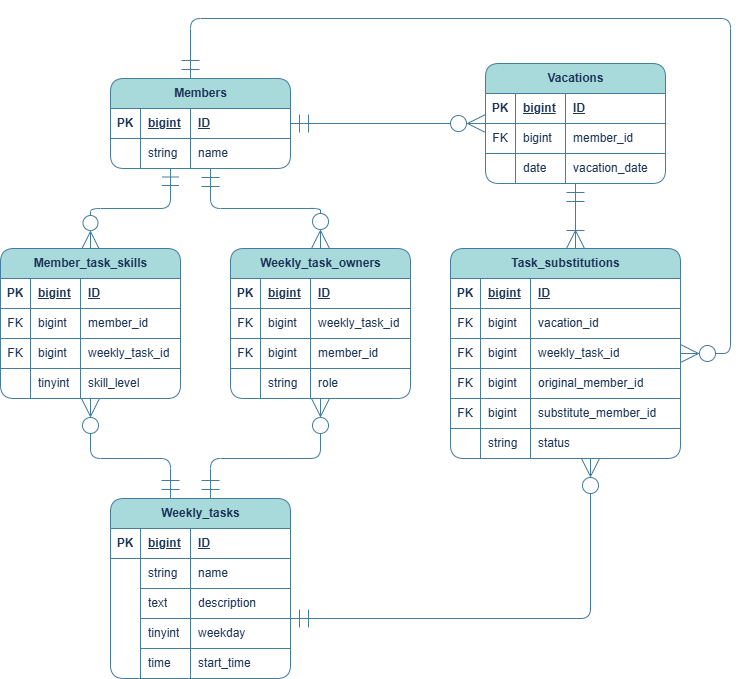

# ワリフル MVP ER図（要件書ベース初版）

`warifull_mvp_proposal.md` の要件から、MVP実装向けにテーブルを整理した初版ER図です。

`created_at / updated_at` は全テーブル共通のため、このドキュメントのテーブル定義では省略しています。

## テーブル定義（コメント付き）

### `members`
| カラム | 型 | キー | コメント |
| --- | --- | --- | --- |
| `id` | `bigint` | PK | メンバーID |
| `name` | `string` | - | 氏名 |

### `weekly_tasks`
| カラム | 型 | キー | コメント |
| --- | --- | --- | --- |
| `id` | `bigint` | PK | 週次業務ID |
| `name` | `string` | - | 業務名 |
| `description` | `text` | - | 業務説明 |
| `weekday` | `tinyint` | - | 実施曜日(1=月 ... 5=金) |
| `start_time` | `time` | - | 実施開始時刻 |

### `member_task_skills`
| カラム | 型 | キー | コメント |
| --- | --- | --- | --- |
| `id` | `bigint` | PK | スキルレコードID |
| `member_id` | `bigint` | FK | メンバーID |
| `weekly_task_id` | `bigint` | FK | 週次業務ID |
| `skill_level` | `tinyint` | - | 0-3の習熟度 |

### `vacations`
| カラム | 型 | キー | コメント |
| --- | --- | --- | --- |
| `id` | `bigint` | PK | 休暇ID |
| `member_id` | `bigint` | FK | 休暇取得メンバーID |
| `vacation_date` | `date` | - | 休暇日 |

### `weekly_task_owners`
| カラム | 型 | キー | コメント |
| --- | --- | --- | --- |
| `id` | `bigint` | PK | 通常担当レコードID |
| `weekly_task_id` | `bigint` | FK | 対象の週次業務ID |
| `member_id` | `bigint` | FK | 通常担当メンバーID |
| `role` | `string` | - | 担当種別(main/sub) |

### `task_substitutions`
| カラム | 型 | キー | コメント |
| --- | --- | --- | --- |
| `id` | `bigint` | PK | 振替レコードID |
| `vacation_id` | `bigint` | FK | 起点となる休暇ID |
| `weekly_task_id` | `bigint` | FK | 振替対象の週次業務ID |
| `original_member_id` | `bigint` | FK | 元担当メンバーID |
| `substitute_member_id` | `bigint` | FK | 振替担当メンバーID |
| `status` | `string` | - | pending/assigned |

## 設計メモ（MVP）
- 通常担当は `weekly_task_owners`、振替担当は `task_substitutions` に分離。
- `weekly_task_owners.role` は `main/sub` で担当種別を表現し、1タスクに複数担当を持てる前提で運用。
- `task_substitutions.status` は `pending/assigned` の2値で運用し、初期値は `pending`。
- 候補提案は都度計算し、MVPでは `reassignment_suggestions` テーブルは持たない。
- `member_task_skills.skill_level` は要件に合わせて `0-3` を使用。
- `weekly_tasks.weekday` は MVP では `1..5`（月〜金）固定で扱う。
- 主目的は現時点の割り振り管理のため、履歴管理（`softDeletes` や期間履歴カラム）はMVPでは持たない。
