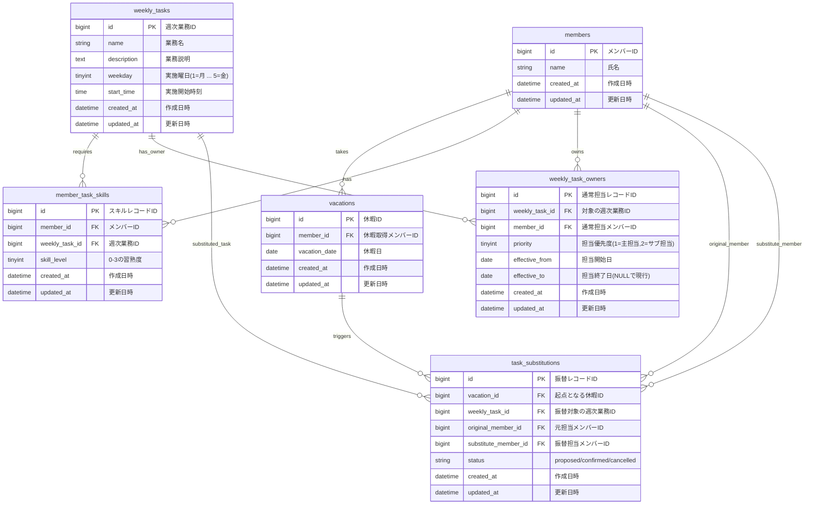

# ワリフル MVP ER図（要件書ベース初版）

`warifull_mvp_proposal.md` の要件から、MVP実装向けにテーブルを整理した初版ER図です。

## 設計メモ（MVP）
- 通常担当は `weekly_task_owners`、振替担当は `task_substitutions` に分離。
- `weekly_task_owners.priority` は主担当/副担当の順序表現に利用可能（単一担当なら固定値で運用）。
- `task_substitutions.status` は `proposed` / `confirmed` などを想定。
- 候補提案は都度計算し、MVPでは `reassignment_suggestions` テーブルは持たない。
- `member_task_skills.skill_level` は要件に合わせて `0-3` を使用。
